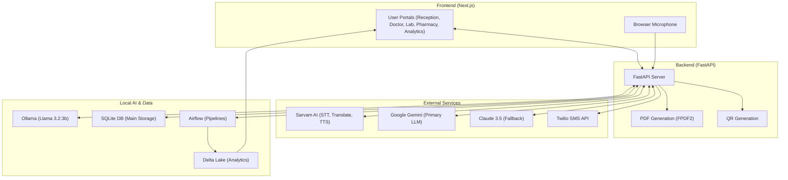
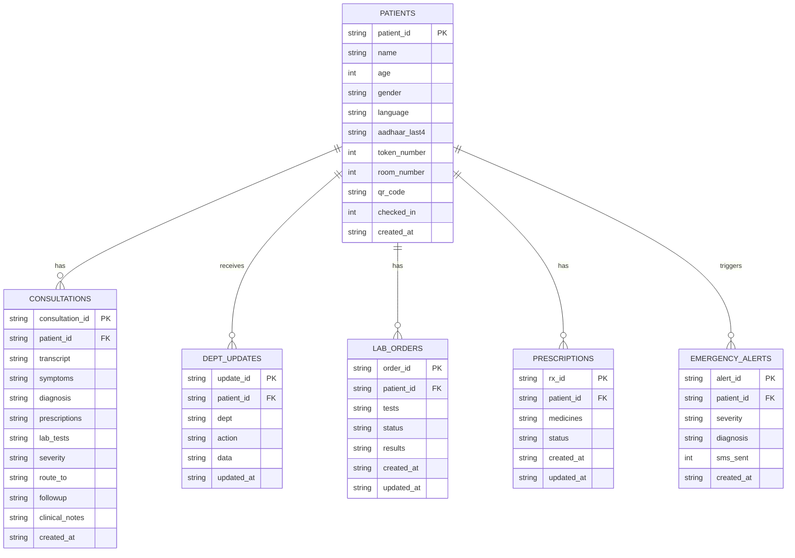

# VaidikaAI v3 🏥
**AI-powered multilingual hospital workflow — Protothon Hackathon 2025**

> Speak any language. Receive world-class care.

---

## What's New in v3
- 🎤 **Real-time bilingual voice** — patient speaks Hindi, doctor hears English live. Doctor speaks English, patient hears it in Hindi instantly.
- 📱 **QR code on every token slip** — scan at doctor, lab, pharmacy to load patient in one second.
- 🖨️ **Print-ready token slip** — generates from browser with embedded QR code.
- 📄 **Clinical PDF Generation** — Download a professional, formatted clinical record PDF with one click.
- 🔉 **Bilingual Kiosk & Discharge** — System speaks to patients in their preferred language during check-in and discharge.
- 🚨 **Emergency SMS alerts** — Twilio sends SMS to duty team for high/emergency cases automatically.
- 📊 **Analytics dashboard** — live stats, severity breakdown, language chart, dept completion rates.
- 🤖 **Multi-LLM Intelligence** — Support for Google Gemini (Primary), Llama 3.2 (Local), and Claude 3.5.
- 🔄 **Returning Patients** — One-click re-registration via patient ID or QR scan.

---

## Architecture



---

## Project Structure

```
vaidika-v3/
├── agents/
│   ├── schema.py                   # All Pydantic models
│   └── consultation_agent.py       # Qwen2.5:7b via Ollama
├── voice/
│   └── sarvam.py                   # STT + translate + TTS + bilingual pipeline
├── api/
│   ├── database.py                 # SQLite init (all tables)
│   ├── qr_utils.py                 # QR code generation (base64 PNG)
│   ├── pdf_utils.py                # FPDF2 clinical record PDF generation
│   ├── alerts.py                   # Twilio SMS emergency alerts
│   └── main.py                     # FastAPI — 15+ endpoints
├── pipelines/
│   └── hospital_dag.py             # Airflow DAG (parallel lab+pharmacy+alert)
├── data/
│   └── spark_manager.py            # PySpark + Delta Lake
├── docker/
│   ├── Dockerfile.backend
│   └── docker-compose.yml
├── vaidika-ui/
│   ├── app/
│   │   ├── page.js                 # Home hub (API/Ollama/DB status)
│   │   ├── reception/page.js       # Register + QR slip + print
│   │   ├── token-display/page.js   # Waiting room TV
│   │   ├── doctor/page.js          # Bilingual voice + AI record + PDF + discharge
│   │   ├── lab/page.js             # QR scan + enter results
│   │   ├── pharmacy/page.js        # QR scan + dispense
│   │   └── analytics/page.js       # Live dashboard
│   ├── components/
│   │   ├── QRScanner.js            # Camera QR scanner (html5-qrcode)
│   │   └── PatientLoader.js        # Reusable: text input + QR scan button
│   ├── lib/
│   │   ├── api.js                  # All API calls
│   │   └── useRecorder.js          # Browser mic recording hook
│   └── package.json
├── requirements.txt
└── .env.example
```

---

## Setup

### Step 1 — Environment variables
```bash
cp .env.example .env
```
Fill in `.env`:
| Key | Where to get it |
|-----|----------------|
| `SARVAM_API_KEY` | https://dashboard.sarvam.ai → Sign up → API Keys |
| `GOOGLE_API_KEY` | https://aistudio.google.com → Get API Key |
| `TWILIO_ACCOUNT_SID` | https://twilio.com → Console (leave blank to disable SMS) |
| `TWILIO_AUTH_TOKEN` | Twilio Console |
| `TWILIO_FROM_NUMBER` | Your Twilio phone number |
| `EMERGENCY_ALERT_NUMBER` | Doctor/duty team phone number |

### Step 2 — Python dependencies
```bash
# Core API (Python 3.10 to 3.14 supported)
pip install -r requirements.txt

# Optional: Data Pipelines (Requires Python < 3.14)
# pip install -r requirements-pipelines.txt
```
> [!NOTE]
> The core API supports Python 3.14. However, `apache-airflow` and `pyspark` do not yet support Python 3.14. If you are on Python 3.14, the API will automatically skip these features.


### Step 3 — Ollama + Qwen2.5
```bash
# Linux/Mac
curl -fsSL https://ollama.com/install.sh | sh
ollama serve &
ollama pull llama3.2:3b

# Verify
ollama list   # should show llama3.2:3b
```

### Step 4 — Test AI agent alone
```bash
python -m agents.consultation_agent
# Prints a filled ClinicalRecord JSON in ~3 seconds
```

### Step 5 — Start backend
```bash
python api/main.py
# API:  http://localhost:8000
# Docs: http://localhost:8000/docs
```

### Step 6 — Start frontend
```bash
cd vaidika-ui
npm install
npm run dev
# Frontend: http://localhost:3000
```

---

## Data Model (ERD)



---

## Patient Journey

### 1. Reception → `/reception`
- Staff enters patient name, age, gender, preferred language.
- System generates Patient ID (`VK-2025-XXXXX`), token, and room.
- Click **🖨️ Print Token Slip** → patient carries this slip with QR.

### 2. Waiting Room → `/token-display` & `/checkin`
- TV screen shows current tokens + room numbers.
- Patient scans QR at kiosk → hears welcome message in their language.

### 3. Doctor → `/doctor`
- Staff scans patient QR code.
- **Bilingual voice consultation:**
  - Click **"Record Patient"** → patient speaks Hindi → doctor sees English.
  - Click **"Record Doctor"** → doctor speaks English → patient hears Hindi.
- Click **CONFIRM** → Qwen2.5 generates clinical record.
- **📄 Download PDF** → Professional record instantly generated.
- **🔉 Discharge** → Patient hears final instructions in their language.

### 4. Lab & Pharmacy → `/lab` & `/pharmacy`
- Scan QR → enter results or mark medicines dispensed.
- Updates sync back to the main clinical record.

### 5. Analytics → `/analytics`
- Live stats, emergency alerts, and department progress bars.

---

## API Endpoints

| Method | Endpoint | Description |
|--------|----------|-------------|
| GET | `/health` | API + Ollama + DB status |
| POST | `/register` | Register patient → ID + token + QR code |
| GET | `/patient/{id}` | Get patient info |
| POST | `/checkin` | Kiosk check-in → welcome audio |
| POST | `/voice/patient-speech` | Audio → STT + translate to English |
| POST | `/voice/doctor-speech` | Audio → STT → translate + TTS output |
| POST | `/consultation` | Transcript → AI record → SMS + Analytics |
| GET | `/record/{id}` | Full record (consult + lab + pharmacy) |
| GET | `/patient/{id}/pdf` | **NEW: Generate Clinical Record PDF** |
| GET | `/discharge/{id}` | Discharge message + billing + audio |
| POST | `/department/update` | Lab/pharmacy post results |
| GET | `/tokens/active` | Today's token list |
| GET | `/analytics/summary` | Full dashboard stats |
| POST | `/translate` | Translate any text (Sarvam) |
| POST | `/speak-b64` | Text → speech audio base64 |

---

## Tech Stack

| Component | Technology |
|-----------|-----------|
| Local AI | Llama 3.2:3b via Ollama (100% offline) |
| Cloud AI | Google Gemini Flash 1.5 & Claude 3.5 |
| Voice | Sarvam AI (saarika:v2.5, mayura-v1, bulbul-v2) |
| QR | `qrcode` (Python) + `html5-qrcode` (JS) |
| PDF | `fpdf2` (Python) |
| Backend | FastAPI + SQLite |
| Frontend | Next.js 14 + Tailwind CSS |
| Pipeline | Apache Airflow 2.9 (Optional) |
| Data | PySpark 3.5 + Delta Lake 3.1 (Optional) |

---
*VaidikaAI v3 — Protothon Hackathon 2025*
